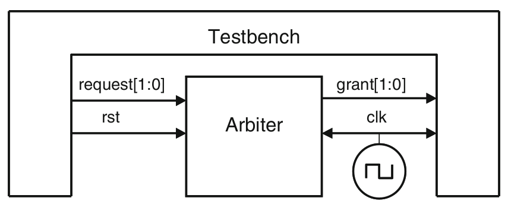
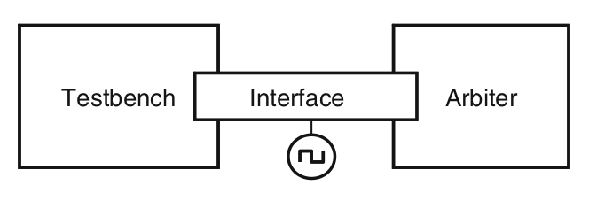
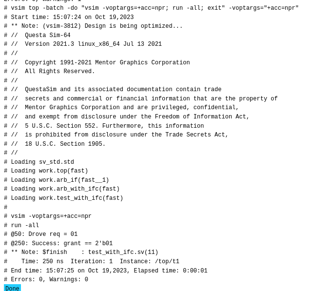
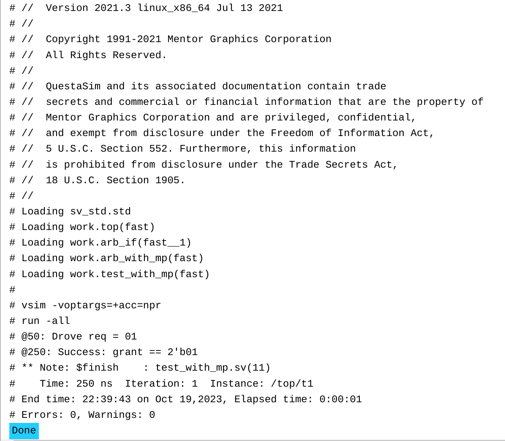

# Assignment

## Communication of Arbiter-Test Bench via Ports

### RTL Diagram



### Files

- `top.sv`
```verilog
module top;
	logic [1:0] grant, request;
	bit clk;
	always #50 clk = ~clk;
	
	arb_with_port a1 (grant, request, rst, clk);
	test_with_port t1 (grant, request, rst, clk);
endmodule
```

- `test_with_port.sv`
```verilog
module test_with_port (input logic [1:0] grant,
					   output logic [1:0] request,
					   output bit rst,
					   input bit clk);
	initial begin
		@(posedge clk);
		request <= 2'b01;
		$display("@%0t: Drove req = 01", $time);
		repeat (2) @(posedge clk);
		if (grant == 2'b01)
			$display("@%0t: Success: grant == 2'b01", $time);
		else
			$display("@%0t: Error: grant != 2'b01", $time);
		$finish;
	end
endmodule
```

- `design.sv`
```verilog
module arb_with_port (output logic [1:0] grant,
					  input logic [1:0] request,
					  input bit rst, clk);
	always @(posedge clk or posedge rst)
		begin
			if (rst)
				grant <= 2'b00;
			else if (request[0])  // High priority
				grant <= 2'b01;
			else if (request[1])  // Low priority
				grant <= 2'b10;
			else
				grant <= '0;
		end
endmodule
```

- `testbench.sv` - On EDA Playground
```verilog
`include "test_with_port.sv"
`include "design.sv"
`include "top.sv"
```

### Execution on EDA Playground


-----------------------------------------------------------------------------------------------------------------------------------------------

## Communication of Arbiter-Test Bench via Interfaces

### RTL Diagram



### Files

- `top.sv`
```verilog
module top;
	bit clk;
	always #50 clk = ~clk;
	
	arb_if arbif(clk);
	arb_with_ifc a1(arbif);
	test_with_ifc t1(arbif);
endmodule : top
```

- `test_with_ifc.sv`
```verilog
module test_with_ifc (arb_if arbif);
	initial begin
		@(posedge arbif.clk);
		arbif.request <= 2'b01;
		$display("@%0t: Drove req = 01", $time);
		repeat (2) @(posedge arbif.clk);
		if (arbif.grant == 2'b01)
			$display("@%0t: Success: grant == 2'b01", $time);
		else
			$display("@%0t: Error: grant != 2'b01", $time);
		$finish;
	end
endmodule
```

- `design.sv`
```verilog
module arb_with_ifc (arb_if arbif);
	always @(posedge arbif.clk or posedge arbif.rst)
		begin
			if (arbif.rst)
				arbif.grant <= 2'b00;
			else if (arbif.request[0])  // High priority
				arbif.grant <= 2'b01;
			else if (arbif.request[1])  // Low priority
				arbif.grant <= 2'b10;
			else
				arbif.grant <= '0;
		end
endmodule
```

- `ifc.sv`
```verilog
interface arb_if(input bit clk);
	logic [1:0] grant, request;
	bit rst;
endinterface
```

- `testbench.sv` - On EDA Playground
```verilog
`include "top.sv"
`include "design.sv"
`include "ifc.sv"
`include "test_with_ifc.sv"
```

### Execution on EDA Playground



-----------------------------------------------------------------------------------------------------------------------------------------------

## Communication of Arbiter-Test Bench via Modports - Type 1

### Files

- `top.sv`
```verilog
module top;
	bit clk;
	always #50 clk = ~clk;
	
	arb_if arbif(clk);
	arb_with_mp a1(arbif);
	test_with_mp t1(arbif);
endmodule : top
```

- `test_with_mp.sv`
```verilog
module test_with_mp (arb_if.TEST arbif);
	initial begin
		@(posedge arbif.clk);
		arbif.request <= 2'b01;
		$display("@%0t: Drove req = 01", $time);
		repeat (2) @(posedge arbif.clk);
		if (arbif.grant == 2'b01)
			$display("@%0t: Success: grant == 2'b01", $time);
		else
			$display("@%0t: Error: grant != 2'b01", $time);
		$finish;
	end
endmodule
```

- `design.sv`
```verilog
module arb_with_mp (arb_if.DUT arbif);
	always @(posedge arbif.clk or posedge arbif.rst)
		begin
			if (arbif.rst)
				arbif.grant <= 2'b00;
			else if (arbif.request[0])  // High priority
				arbif.grant <= 2'b01;
			else if (arbif.request[1])  // Low priority
				arbif.grant <= 2'b10;
			else
				arbif.grant <= '0;
		end
endmodule
```

- `ifc.sv`
```verilog
interface arb_if(input bit clk);
	logic [1:0] grant, request;
	bit rst;
	modport TEST (output request, rst, input grant, clk);
	modport DUT (input request, rst, clk, input grant);
endinterface
```

- `testbench.sv` - On EDA Playground
```verilog
`include "test_with_mp.sv"
`include "design.sv"
`include "top.sv"
`include "ifc.sv"
```

### Execution on EDA Playground



-----------------------------------------------------------------------------------------------------------------------------------------------

## Communication of Arbiter-Test Bench via Modports - Type 2

### Files

- `top.sv`
```verilog
module top;
	bit clk;
	always #50 clk = ~clk;
	
	arb_if arbif(clk);
	arb_with_mp a1(arbif.DUT);
	test_with_mp t1(arbif.TEST);
endmodule : top
```

- `test_with_mp.sv`
```verilog
module test_with_mp (arb_if.TEST arbif);
	initial begin
		@(posedge arbif.clk);
		arbif.request <= 2'b01;
		$display("@%0t: Drove req = 01", $time);
		repeat (2) @(posedge arbif.clk);
		if (arbif.grant == 2'b01)
			$display("@%0t: Success: grant == 2'b01", $time);
		else
			$display("@%0t: Error: grant != 2'b01", $time);
		$finish;
	end
endmodule
```

- `design.sv`
```verilog
module arb_with_mp (arb_if.DUT arbif);
	always @(posedge arbif.clk or posedge arbif.rst)
		begin
			if (arbif.rst)
				arbif.grant <= 2'b00;
			else if (arbif.request[0])  // High priority
				arbif.grant <= 2'b01;
			else if (arbif.request[1])  // Low priority
				arbif.grant <= 2'b10;
			else
				arbif.grant <= '0;
		end
endmodule
```

- `ifc.sv`
```verilog
interface arb_if(input bit clk);
	logic [1:0] grant, request;
	bit rst;
  modport TEST (output request, rst, input grant, clk);
  modport DUT (input request, rst, clk, input grant);
endinterface
```

- `testbench.sv` - On EDA Playground
```verilog
`include "test_with_mp.sv"
`include "design.sv"
`include "top.sv"
`include "ifc.sv"
```

### Execution on EDA Playground


--------------------------------------------------------------------------------------------------------------------------------------------