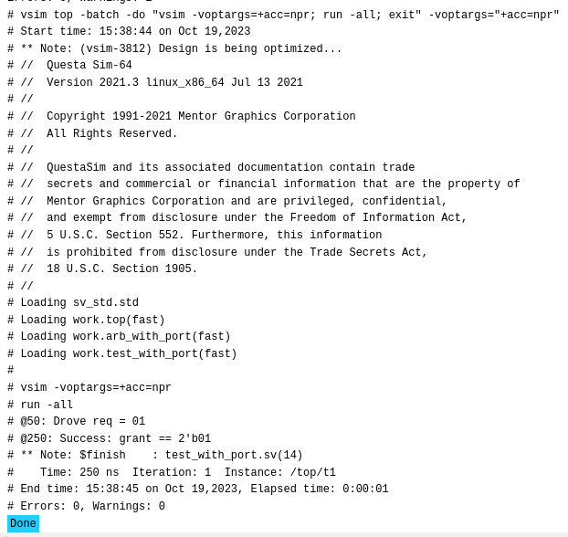

# Assignment

## Communication of Arbiter-Test Bench via Ports

- `top.sv`
```verilog
module top;
	logic [1:0] grant, request;
	bit clk;
	always #50 clk = ~clk;
	
	arb_with_port a1 (grant, request, rst, clk);
	test_with_port t1 (grant, request, rst, clk);
endmodule
```

- `test_with_port.sv`
```verilog
module test_with_port (input logic [1:0] grant,
					   output logic [1:0] request,
					   output bit rst,
					   input bit clk);
	initial begin
		@(posedge clk);
		request <= 2'b01;
		$display("@%0t: Drove req = 01", $time);
		repeat (2) @(posedge clk);
		if (grant == 2'b01)
			$display("@%0t: Success: grant == 2'b01", $time);
		else
			$display("@%0t: Error: grant != 2'b01", $time);
		$finish;
	end
endmodule
```

- `design.sv`
```verilog
module arb_with_port (output logic [1:0] grant,
					  input logic [1:0] request,
					  input bit rst, clk);
	always @(posedge clk or posedge rst)
		begin
			if (rst)
				grant <= 2'b00;
			else if (request[0])  // High priority
				grant <= 2'b01;
			else if (request[1])  // Low priority
				grant <= 2'b10;
			else
				grant <= '0;
		end
endmodule
```

- `testbench.sv` - On EDA Playground
```verilog
`include "test_with_port.sv"
`include "design.sv"
`include "top.sv"
```

### RTL Diagram


### Execution on EDA Playground



